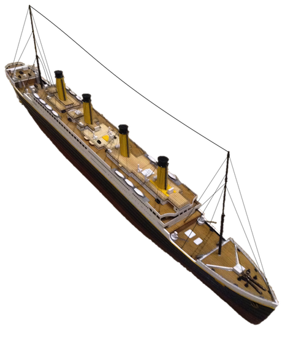
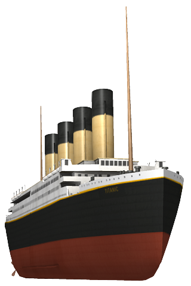
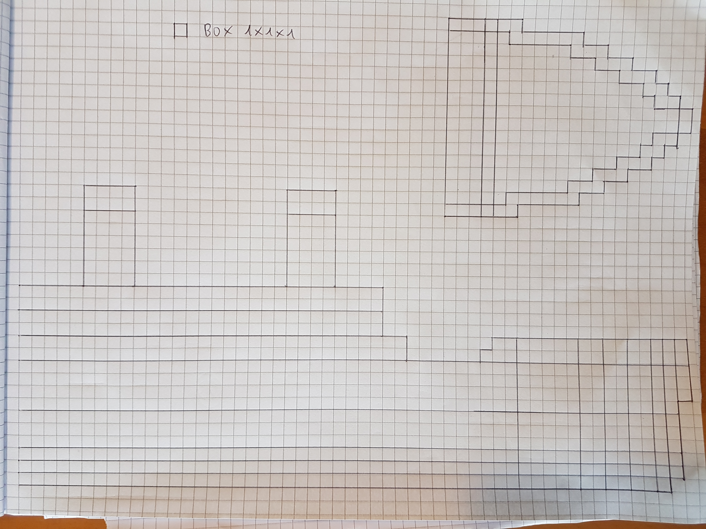
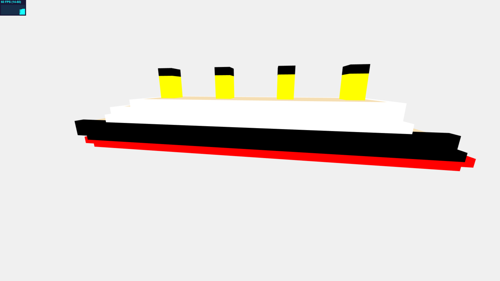
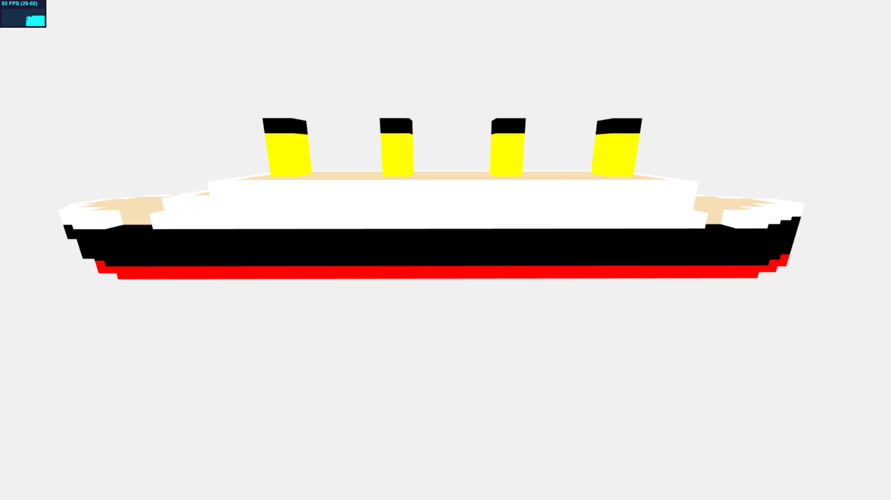

# 27 aprile 2019

* Lettura e comprensione della consegna nella repository `Cubes`.
* Valutazione sul tipo di scena da rappresentare: preferibile utilizzare come spunto una scena famosa tratta da un film o da un avvenimento celebre.
* Decisione di rappresentare l'incidente del Titanic per la grande quantità di materiale online dal quale prendere ispirazione.
* Ricerca di immagini e materiale utile per la realizzazione della scena.

|  |
| :-----------------------------------: |
| [Titanic](https://pngimg.com/download/65349) |

|  |
| :---------------------------------: |
| [Ponte](https://pngimg.com/download/65388) |

|  |
| :--------------------------------: |
| [Prua](https://pngimg.com/download/65385) |

Immagini da [pngimg.com](https://pngimg.com).
* Prime prove di progettazione della nave su carta e di disegno in three.js.
* Creazione del file `journal.md`

# 28 aprile 2019

* Progettazione su carta della nave.

|  |
| :---------------------------------------------: |
| Disegno della parte anteriore della nave |

* Prove di disegno del progetto in three.js.
* La nave risulta troppo grande e pesante da rappresentare: revisione del codice scalando l'immagine e migliorando l'efficienza di alcune parti.
* Risultato non ancora soddisfacente: si rende necessaria una revisione del progetto.
* Schizzo su carta del progetto con dimensioni minori.

|  |
| :-----------------------------------------------: |
| Primo schizzo della nave con le dimensioni riviste |

* Riprogettazione totale su carta della nave.
* Aggiornamento journal.
* Prime prove di disegno del nuovo progetto in three.js.

# 1 maggio 2019

* Revisione progetto e prove di disegno del nuovo progetto in three.js.
* Risultati di prova accettabili.
* Aggiornamento del journal.
* Decisione di suddividere il Titanic in 5 parti per semplificare il codice e la costruzione: scafo, ponte, fumaioli, prua e poppa.
* Inizio scrittura del codice dello scafo (classe **Hull**).
* Aggiornamento journal.

# 2 maggio 2019

* Scrittura del codice dello scafo (classe **Hull**), del ponte (**Deck**) e dei fumaioli (**Funnel**).

|  |
| :--------------------------------------------: |
| Nave composta da **Hull**, **Deck** e i quattro **Funnel** |

* Alcune difficoltà con la scrittura del codice di poppa (**Stern**) e prua (**Bow**): il risultato sembra presentare errori di costruzione.
* Aggiornamento journal.

# 3 maggio 2019

* Creazione della repository del progetto.
* Risoluzione problemi di poppa e prua grazie all'utilizzo di cubi wireframe.
* Fine della scrittura del codice delle parti del Titanic.

|  |
| :-----------------------------------------: |
| Titanic completo |

* Aggiornamento journal.

# 4 maggio 2019

* Prove di utilizzo della funzione fornita (*getHeightData*) per comprendere il meccanismo della creazione del terreno.
* Prove di disegno di una heightmap (utilizzando Microsoft Paint) e interazioni con la funzione.
* Scrittura del codice della classe **Terrain** che contiene la funzione per la creazione del terreno (cioè l'oceano e l'iceberg).
* Progettazione e prove di creazione dell'iceberg nella heightmap.
* Prime prove di animazione della scena (impatto e naufragio).
* Valutazioni sull'inserimento di nebbia.
* Aggiornamento journal.

# 9 maggio 2019

* Aggiornamento di alcuni file della cartella `lib`, sostituiti con versioni più moderne.
* Lavoro sulle animazioni dell'impatto e della prima fase del naufragio.
* Dopo alcune prove, presa la decisione di utilizzare la classe **Clock** per calcolare i tempi delle animazioni.
* Aggiornamento journal.

# 10 maggio 2019

* Lavoro su animazioni: alcuni problemi nell'implementazione della decelerazione della nave.
* I problemi erano dovuti ad una disattenzione nella scrittura del codice: risolti. Animazioni del naufragio completate.
* Inserimento blocco verticale della telecamera al livello del mare in modo che l'osservatore non possa osservare sottacqua.
* Ricerca di texture per il cielo.
* Aggiornamento journal.
